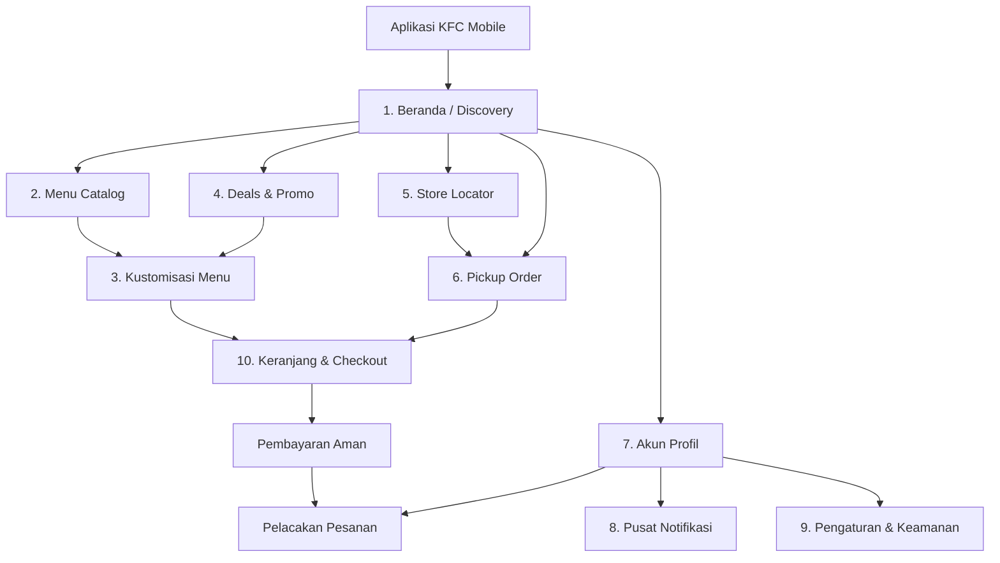

<div align="center">

# 🍗 KFC Mobile App Redesign — UI/UX Case Study

<p align="center">
  
</p>

<p align="center">
  <b>Transformasi digital pengalaman pemesanan makanan cepat saji dengan antarmuka modern, intuitif, cepat, dan berpusat pada kepuasan pelanggan (Customer-Centric).</b>
</p>

<p align="center">
  <a href="https://www.figma.com/"></a>
  
  
  
  
  
</p>

</div>

---

## ✨ Tentang Proyek

**KFC Mobile App Redesign** adalah inisiatif perancangan ulang antarmuka (*User Interface*) dan pengalaman pengguna (*User Experience*) aplikasi mobile resmi **KFC (Kentucky Fried Chicken)**. Proyek ini memadukan estetika visual kontemporer bernuansa khas merah KFC (*Colonel's Signature Red*) dengan arsitektur navigasi yang bersih, terstruktur, dan efisien.

Fokus utama desain ini adalah menyederhanakan alur pemesanan makanan (*frictionless ordering flow*), memperjelas penawaran promo, mengintegrasikan fitur *pickup* tanpa antre, serta menghadirkan transparansi penuh pada pelacakan pesanan dan saldo loyalitas pengguna.

---

## 🗺️ Arsitektur Informasi & Alur Pengguna



---

## 📱 Analisis Fitur Utama Aplikasi

Berikut adalah analisis fitur-fitur utama yang dirancang pada **KFC Mobile App Redesign**, mencakup fungsi interaksi, komponen kunci, serta nilai tambah dari perspektif *User Experience* (UX):

<table>
  <thead>
    <tr>
      <th width="20%">Fitur Utama</th>
      <th width="15%">Layar / Modul</th>
      <th width="35%">Fungsi &amp; Komponen Kunci</th>
      <th width="30%">Analisis UX &amp; Nilai Tambah</th>
    </tr>
  </thead>
  <tbody>
    <tr>
      <td><b>Quick Discovery &amp; Hero Promo</b></td>
      <td>Beranda (<i>Home</i>)</td>
      <td>Carousel banner promo beresolusi tinggi (<i>PetooOk Group</i>), 4 tombol navigasi cepat (<i>Menu, Deals, Location, Pickup</i>), dan kurasi menu favorit dengan tombol aksi cepat <code>(+)</code>.</td>
      <td><b>Meminimalkan Beban Kognitif:</b> Mengarahkan perhatian pengguna ke penawaran terbaik sejak awal dan memberikan akses langsung ke 4 alur esensial dalam satu ketukan jari.</td>
    </tr>
    <tr>
      <td><b>Katalog &amp; Filter Menu Pintar</b></td>
      <td>Menu Catalog</td>
      <td>Filter kategori horizontal berbentuk <i>pill-tabs</i> (<i>All, Chicken, Classic, Box, Bucket</i>), kolom pencarian instan, dan kartu menu vertikal yang rapi.</td>
      <td><b>Eksplorasi Efisien:</b> Mencegah <i>endless scrolling</i> yang melelahkan. Visual menu berjarak optimal (<i>whitespace</i>) meningkatkan daya tarik dan mempermudah perbandingan harga.</td>
    </tr>
    <tr>
      <td><b>Kustomisasi Paket &amp; Upselling</b></td>
      <td>Detail Produk</td>
      <td>Pilihan radio varian paket ayam &amp; nasi (3–9 pcs), opsi minuman tambahan berbayar (Float, Milo, Cola), <i>stepper</i> porsi <code>[-] 1 [+]</code>, dan <i>sticky bottom CTA</i> <b>"Add To Cart"</b>.</td>
      <td><b>Frictionless Customization:</b> Menghilangkan kebingungan saat memilih variasi menu porsi besar sekaligus mendorong penjualan produk pelengkap (<i>upselling</i>) secara transparan tanpa mengganggu alur.</td>
    </tr>
    <tr>
      <td><b>Hub Promo &amp; Penawaran Spesial</b></td>
      <td>Deals Hub</td>
      <td>Filter diskon (<i>Promotion, Combo, Thrifty</i>), lencana persentase hemat (<i>up to 41% Thrifty</i>), serta perbandingan harga coret dengan harga promo.</td>
      <td><b>Conversion Booster:</b> Memperjelas <i>perceived value</i> (keuntungan hemat) yang didapatkan pelanggan, memicu keputusan pembelian yang lebih cepat dan bernilai ekonomis.</td>
    </tr>
    <tr>
      <td><b>Pencari Gerai &amp; Peta Interaktif</b></td>
      <td>Store Locator</td>
      <td>Deteksi lokasi otomatis (<i>Use my current location</i>), peta interaktif dengan pin gerai, jarak relatif (km), status operasional toko, dan panduan rute navigasi.</td>
      <td><b>Koneksi O2O yang Mulus:</b> Menjembatani kebutuhan digital dengan gerai fisik; memudahkan pelanggan memilih resto terdekat untuk <i>dine-in</i>, <i>takeaway</i>, maupun mempercepat estimasi waktu antar.</td>
    </tr>
    <tr>
      <td><b>Pemesanan Ambil di Resto (Pickup)</b></td>
      <td>Pickup at KFC</td>
      <td>Pemilihan outlet tujuan bebas antre, estimasi waktu penyiapan, dan opsi pemilihan slot waktu ambil (<i>Now / 15 menit, 10.30, 11.00, dst.</i>).</td>
      <td><b>Skip-the-Line Experience:</b> Memberikan kepastian waktu bagi pengguna dengan mobilitas tinggi; makanan dipastikan siap tepat waktu tanpa antrean panjang di kasir.</td>
    </tr>
    <tr>
      <td><b>Gamifikasi Loyalitas &amp; Dompet Digital</b></td>
      <td>Akun / Profil</td>
      <td>Kartu anggota eksklusif bergradien merah (<i>KFC Lovers</i>), dashboard metrik poin (<i>1.250 My Points</i>), kupon diskon aktif, dan saldo dompet digital (<i>Rp 125.000 KFC Balance</i>).</td>
      <td><b>Meningkatkan Retensi Pelanggan:</b> Mendorong kebiasaan bertransaksi ulang (<i>habit loop</i>) dengan memperlihatkan saldo siap pakai dan penghargaan loyalitas secara visual dan prestisius.</td>
    </tr>
    <tr>
      <td><b>Pelacak Pesanan 5-Tahap</b></td>
      <td>Akun / Profil</td>
      <td>Indikator status pesanan visual bertahap (<i>Not paid yet, Process, Sent, Done, Canceled</i>) dilengkapi lencana jumlah pesanan aktif.</td>
      <td><b>Menghilangkan Kecemasan Menunggu:</b> Menghadirkan transparansi penuh mengenai tahapan pesanan pelanggan secara real-time, dari dapur hingga pesanan selesai.</td>
    </tr>
    <tr>
      <td><b>Pusat Notifikasi Cerdas</b></td>
      <td>Notifications</td>
      <td>Filter jenis notifikasi (<i>Promotion, Order, Information</i>), tombol <i>"Tandai semua dibaca"</i>, dan ajakan ulasan pesanan berhadiah 50 poin loyalitas.</td>
      <td><b>Komunikasi Terorganisasi:</b> Mencegah informasi pesanan penting tenggelam oleh broadcast promo, serta meningkatkan keterlibatan pengguna pasca-pembelian (<i>post-purchase feedback</i>).</td>
    </tr>
    <tr>
      <td><b>Keranjang Belanja &amp; Gamifikasi Ongkir</b></td>
      <td>Cart &amp; Checkout</td>
      <td>Progress bar dinamis target belanja gratis ongkir (<i>e.g., Belanja min. Rp75.000 hemat Rp15.000</i>), penyesuaian jumlah item real-time, dan kolom catatan khusus (<i>Order notes</i>).</td>
      <td><b>Meningkatkan Nilai Transaksi (AOV):</b> Memberi dorongan psikologis bagi pelanggan untuk menambah item belanja demi mencapai batas gratis ongkir, sekaligus menekan <i>cart abandonment</i>.</td>
    </tr>
    <tr>
      <td><b>Ringkasan Pembayaran &amp; Keamanan</b></td>
      <td>Cart &amp; Checkout</td>
      <td>Rincian transparan (subtotal, ongkir, diskon pengiriman, voucher), notifikasi perolehan poin (<i>158 Poin Rewards</i>), pemilihan metode bayar, dan lencana enkripsi transaksi aman.</td>
      <td><b>Membangun Kepercayaan (Trust):</b> Tidak ada biaya tersembunyi (<i>no hidden fees</i>) dan jaminan keamanan transaksi membuat pelanggan merasa aman menyelesaikan pesanan.</td>
    </tr>
    <tr>
      <td><b>Pengaturan Akun &amp; Personalisasi Tema</b></td>
      <td>Settings</td>
      <td>Manajemen profil dan kata sandi, pengaturan alamat kirim, preferensi bahasa (<i>Language</i>), pilihan tema aplikasi (<i>Bright / Dark</i>), dan pusat bantuan.</td>
      <td><b>Kontrol Pengguna yang Fleksibel:</b> Memberikan kebebasan personalisasi tampilan dan kenyamanan navigasi sesuai kebutuhan masing-masing pengguna.</td>
    </tr>
  </tbody>
</table>

---

## 📂 Struktur File Proyek

```plaintext
kfc-mobile-redesign/
│
├── KFC Mobile App.fig       # Master File Desain Figma (Vektor, Layout, Komponen & Varian)
├── kfc-preview.png          # Mockup Showcase Multi-Screen Beresolusi Tinggi (10 Layar)
└── README.md                # Dokumentasi Proyek, Analisis UX, dan Panduan Lengkap
```

---

## 🚀 Cara Mengakses & Menggunakan File Figma

1. **Unduh File**: Pastikan Anda telah mengunduh atau mengkloning berkas `KFC Mobile App.fig` dari repositori ini.
2. **Buka Figma**:
   - Jalankan aplikasi **Figma Desktop** atau buka [figma.com](https://www.figma.com/) di browser Anda.
3. **Import File**:
   - Masuk ke dashboard Figma Anda.
   - Klik tombol **"Import file"** di pojok kanan atas atau langsung *drag-and-drop* berkas `KFC Mobile App.fig` ke kanvas proyek Figma Anda.
4. **Eksplorasi**:
   - Semua frame, komponen, auto-layout, dan gaya teks dapat diedit secara bebas untuk keperluan eksplorasi maupun portofolio.

---

## 👥 Tim Desainer & Kolaborator

Proyek desain ini dirancang dan dikembangkan secara kolaboratif oleh:

| Desainer | Peran & Kontribusi |
| :--- | :--- |
| **I Wayan Winanda** | UI/UX Designer, Design System & Information Architecture |
| **Ni Kadek Ristya Dewi** | UI/UX Designer, User Experience & Visual Interface Design |

---

## ⚖️ Penafian (Disclaimer)

*Proyek ini merupakan karya studi kasus desain konseptual independen (Unsolicited Redesign Case Study) untuk tujuan pembelajaran, portofolio, dan eksplorasi desain UI/UX. Semua merek dagang, logo, nama produk, dan hak cipta yang terkait dengan **KFC (Kentucky Fried Chicken)** adalah milik masing-masing pemilik resminya (Yum! Brands / PT Fast Food Indonesia Tbk).*

---

<p align="center">
  Didesain dengan ❤️ dan dedikasi oleh <b>I Wayan Winanda</b> & <b>Ni Kadek Ristya Dewi</b>
</p>