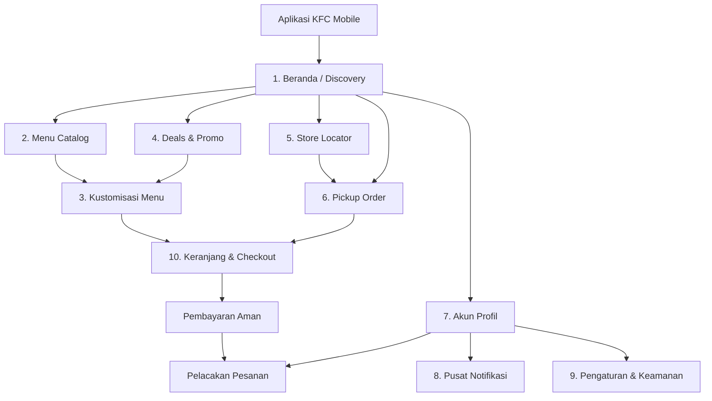

<div align="center">

# 🍗 KFC Mobile App Redesign — UI/UX Case Study

<p align="center">
  
</p>

<p align="center">
  <b>Transformasi digital pengalaman pemesanan makanan cepat saji dengan antarmuka modern, intuitif, cepat, dan berpusat pada kepuasan pelanggan (Customer-Centric).</b>
</p>

<p align="center">
  <a href="https://www.figma.com/"></a>
  
  
  
  
  
</p>

</div>

---

## ✨ Tentang Proyek

**KFC Mobile App Redesign** adalah inisiatif perancangan ulang antarmuka (*User Interface*) dan pengalaman pengguna (*User Experience*) aplikasi mobile resmi **KFC (Kentucky Fried Chicken)**. Proyek ini memadukan estetika visual kontemporer bernuansa khas merah KFC (*Colonel's Signature Red*) dengan arsitektur navigasi yang bersih, terstruktur, dan efisien.

Fokus utama desain ini adalah menyederhanakan alur pemesanan makanan (*frictionless ordering flow*), memperjelas penawaran promo, mengintegrasikan fitur *pickup* tanpa antre, serta menghadirkan transparansi penuh pada pelacakan pesanan dan saldo loyalitas pengguna.

---

## 🗺️ Arsitektur Informasi & Alur Pengguna



---

## ✨ Fitur Unggulan

Berikut adalah beberapa fitur unggulan yang dirancang pada aplikasi **KFC Mobile Redesign**:

<table>
  <thead>
    <tr>
      <th width="25%">Fitur Unggulan</th>
      <th width="25%">Halaman</th>
      <th width="50%">Keterangan</th>
    </tr>
  </thead>
  <tbody>
    <tr>
      <td><b>Quick Order &amp; Menu Favorit</b></td>
      <td>Beranda (<i>Home</i>)</td>
      <td>Pencarian menu instan, filter kategori makanan, dan tombol tambah cepat ke keranjang belanja.</td>
    </tr>
    <tr>
      <td><b>Kustomisasi Paket &amp; Porsi</b></td>
      <td>Detail Menu</td>
      <td>Pilihan variasi jumlah ayam, nasi, serta opsi tambahan minuman favorit dengan penyesuaian harga real-time.</td>
    </tr>
    <tr>
      <td><b>Pemesanan Ambil Sendiri (Pickup)</b></td>
      <td>Pickup at KFC</td>
      <td>Pesan makanan langsung lewat aplikasi dan pilih jadwal jam pengambilan di gerai tanpa antre di kasir.</td>
    </tr>
    <tr>
      <td><b>Pencari Gerai Terdekat (Store Locator)</b></td>
      <td>Lokasi Restoran</td>
      <td>Peta interaktif dengan deteksi lokasi otomatis, informasi jam operasional, jarak, dan rute menuju outlet KFC.</td>
    </tr>
    <tr>
      <td><b>Katalog Promo &amp; Paket Hemat</b></td>
      <td>Deals &amp; Promo</td>
      <td>Daftar voucher diskon, penawaran kombo spesial, dan potongan harga khusus pengguna aplikasi.</td>
    </tr>
    <tr>
      <td><b>Poin Reward &amp; Saldo Digital</b></td>
      <td>Profil Akun</td>
      <td>Pengumpulan poin di setiap transaksi, saldo dompet digital (<i>KFC Balance</i>), serta kupon diskon siap pakai.</td>
    </tr>
    <tr>
      <td><b>Pelacakan Status Pesanan</b></td>
      <td>Pesanan &amp; Notifikasi</td>
      <td>Pemantauan status pesanan secara bertahap mulai dari proses masak hingga siap diambil atau diantar.</td>
    </tr>
    <tr>
      <td><b>Keranjang &amp; Bebas Ongkir</b></td>
      <td>Keranjang Belanja</td>
      <td>Indikator progres untuk klaim promo gratis ongkir, catatan khusus pesanan, dan rincian pembayaran yang jelas.</td>
    </tr>
  </tbody>
</table>

---

## 📂 Struktur File Proyek

```plaintext
kfc-mobile-redesign/
│
├── KFC Mobile App.fig       # Master File Desain Figma (Vektor, Layout, Komponen & Varian)
├── kfc-preview.png          # Mockup Showcase Multi-Screen Beresolusi Tinggi (10 Layar)
└── README.md                # Dokumentasi Proyek, Analisis UX, dan Panduan Lengkap
```

---

## 🚀 Cara Mengakses & Menggunakan File Figma

1. **Unduh File**: Pastikan Anda telah mengunduh atau mengkloning berkas `KFC Mobile App.fig` dari repositori ini.
2. **Buka Figma**:
   - Jalankan aplikasi **Figma Desktop** atau buka [figma.com](https://www.figma.com/) di browser Anda.
3. **Import File**:
   - Masuk ke dashboard Figma Anda.
   - Klik tombol **"Import file"** di pojok kanan atas atau langsung *drag-and-drop* berkas `KFC Mobile App.fig` ke kanvas proyek Figma Anda.
4. **Eksplorasi**:
   - Semua frame, komponen, auto-layout, dan gaya teks dapat diedit secara bebas untuk keperluan eksplorasi maupun portofolio.

---

## 👥 Tim Desainer & Kolaborator

Proyek desain ini dirancang dan dikembangkan secara kolaboratif oleh:

| Desainer | Peran & Kontribusi |
| :--- | :--- |
| **I Wayan Winanda** | UI/UX Designer, Design System & Information Architecture |
| **Ni Kadek Ristya Dewi** | UI/UX Designer, User Experience & Visual Interface Design |

---

## ⚖️ Penafian (Disclaimer)

*Proyek ini merupakan karya studi kasus desain konseptual independen (Unsolicited Redesign Case Study) untuk tujuan pembelajaran, portofolio, dan eksplorasi desain UI/UX. Semua merek dagang, logo, nama produk, dan hak cipta yang terkait dengan **KFC (Kentucky Fried Chicken)** adalah milik masing-masing pemilik resminya (Yum! Brands / PT Fast Food Indonesia Tbk).*

---

<p align="center">
  Didesain dengan ❤️ dan dedikasi oleh <b>I Wayan Winanda</b> & <b>Ni Kadek Ristya Dewi</b>
</p>