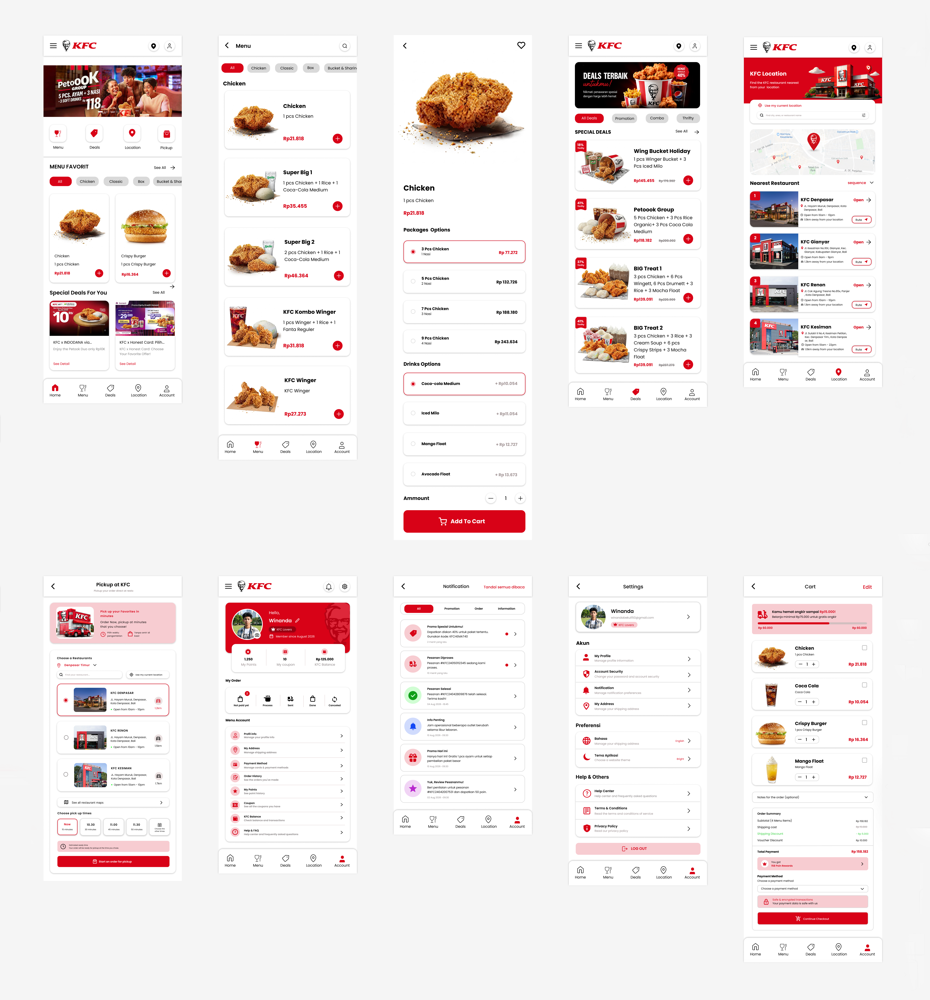
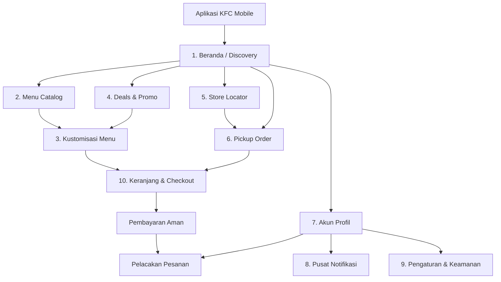

<div align="center">

# 🍗 KFC Mobile App Redesign — UI/UX Case Study

<p align="center">
  
</p>

<p align="center">
  <b>Transformasi digital pengalaman pemesanan makanan cepat saji dengan antarmuka modern, intuitif, cepat, dan berpusat pada kepuasan pelanggan (Customer-Centric).</b>
</p>

<p align="center">
  <a href="https://www.figma.com/"></a>
  
  
  
  
  
</p>

</div>

---

## ✨ Tentang Proyek

**KFC Mobile App Redesign** adalah inisiatif perancangan ulang antarmuka (*User Interface*) dan pengalaman pengguna (*User Experience*) aplikasi mobile resmi **KFC (Kentucky Fried Chicken)**. Proyek ini memadukan estetika visual kontemporer bernuansa khas merah KFC (*Colonel's Signature Red*) dengan arsitektur navigasi yang bersih, terstruktur, dan efisien.

Fokus utama desain ini adalah menyederhanakan alur pemesanan makanan (*frictionless ordering flow*), memperjelas penawaran promo, mengintegrasikan fitur *pickup* tanpa antre, serta menghadirkan transparansi penuh pada pelacakan pesanan dan saldo loyalitas pengguna.

---

## 🗺️ Arsitektur Informasi & Alur Pengguna



---

## 📱 Analisis Layar & Fitur (Screen-by-Screen Breakdown)

Desain ini mencakup **10 layar aplikasi beresolusi tinggi** yang dirancang secara komprehensif:

### 1. Beranda (Home & Discovery)
*Layar utama yang menyambut pengguna dengan konten dinamis dan navigasi cepat.*
- **Top App Bar**: Menampilkan menu drawer, logo resmi KFC, ikon lokasi outlet saat ini, serta avatar profil pengguna.
- **Hero Promotional Carousel**: Banner promo besar beresolusi tinggi (*e.g., "PetooOk Group"* paket hemat keluarga) dengan visual ayam krispi yang menggoda.
- **Quick Action Grid**: 4 pintasan utama dengan ikon bersih: *Menu*, *Deals*, *Location*, dan *Pickup*.
- **Menu Favorit**: Kurasi menu terlaris dengan navigasi tab kategori horizontal (*All, Chicken, Classic, Box, Bucket & Sharing*) dan tombol tambah cepat `(+)`.
- **Special Deals For You**: Kartu kemitraan dan promo pembayaran eksklusif (Indodana, Honest Card, dll.).

### 2. Katalog Menu & Navigasi Kategori
*Daftar menu lengkap yang dirancang rapi tanpa beban visual berlebih.*
- **Header & Search**: Dilengkapi pencarian cepat dan filter kategori sticky.
- **Kategori Terstruktur**: Pengelompokan logis (Ayam, Paket Kombo, Burger, Sides, Minuman).
- **List Card Desain Bersih**: Menampilkan foto makanan di sisi kiri, deskripsi ringkas, harga dengan format mata uang Rupiah yang jelas, serta tombol aksi cepat berwarna merah KFC.

### 3. Kustomisasi & Detail Produk
*Layar detail produk yang mempermudah kustomisasi porsi dan varian.*
- **Immersive Product Hero**: Foto *close-up* potongan ayam renyah di atas piring saji dengan bayangan realistis.
- **Packages Options**: Pilihan radio button yang informatif (3 Pcs, 5 Pcs, 7 Pcs, hingga 9 Pcs beserta jumlah porsi nasi dan penyesuaian harga instan).
- **Drinks Options**: Varian minuman segar (Coca-Cola, Iced Milo, Mango Float, Avocado Float) dengan biaya tambahan transparan.
- **Floating Stepper & CTA**: Pengatur jumlah porsi `[-] 1 [+]` dan tombol penuh *"Add To Cart"* dengan ikon keranjang.

### 4. Penawaran & Promo Spesial (Deals Hub)
*Pusat diskon dan paket hemat untuk memaksimalkan konversi belanja.*
- **Hero Banner "DEALS TERBAIK untukmu"**: Mengedepankan penawaran hemat hingga 40%.
- **Filter Tabs**: Pemisahan kategori diskon (*All Deals, Promotion, Combo, Thrifty*).
- **Kartu Promo Menarik**: Badge persentase hemat (*18% Thrifty, 41% Thrifty*), judul paket, rincian isi paket lengkap, perbandingan harga coret vs harga promo, dan tombol klaim instan.

### 5. Pencari Restoran & Lokasi Interaktif
*Fitur pencari outlet terdekat untuk dine-in, takeaway, maupun delivery.*
- **Hero Banner "KFC Location"**: Panduan menemukan gerai terdekat dari posisi pelanggan.
- **Geolocation Bar**: Tombol instan *"Use my current location"* dan kolom pencarian kota/area.
- **Interactive Map View**: Tampilan peta terintegrasi dengan pin lokasi gerai.
- **Daftar Restoran Terdekat**: Menampilkan nama gerai (KFC Denpasar, KFC Gianyar, KFC Renon, KFC Kesiman), alamat lengkap, jam operasional, estimasi jarak (km), status buka (*Open*), serta tombol rute navigasi.

### 6. Alur Pengambilan di Resto (Pickup at KFC)
*Layanan bebas antre untuk kenyamanan pelanggan yang sedang dalam mobilitas.*
- **Value Proposition Card**: Edukasi manfaat pesan mandiri tanpa antre di kasir.
- **Pemilihan Outlet**: Dropdown area dan daftar pilihan resto terdekat dengan foto outlet.
- **Time Slot Selector**: Pilihan waktu pengambilan fleksibel (*Now / 15 menit, 10.30, 11.00, 11.30, atau pilih jam lain*).
- **Estimasi Akurat**: Konfirmasi waktu persiapan pesanan agar pesanan diterima dalam kondisi hangat dan segar.

### 7. Profil Pengguna & Program Loyalitas
*Pusat kendali akun pengguna dengan integrasi program loyalitas yang gamified.*
- **Red Signature Profile Card**: Kartu anggota bergradien merah dengan watermark ikonik Colonel Sanders, nama pengguna (*Winanda*), lencana *"KFC Lovers"*, dan tahun bergabung.
- **Dashboard Metrik**: Akses cepat ke *My Points* (1.250 Poin), *My Coupon* (10 Kupon), dan *KFC Balance* (Rp 125.000).
- **5-Stage Order Tracker**: Pelacak status transaksi berjalan (*Not paid yet, Process, Sent, Done, Canceled*) lengkap dengan indikator badge pesanan aktif.
- **Menu Akun Komprehensif**: Kelola profil, alamat pengiriman, metode pembayaran, riwayat pesanan, saldo, hingga pusat bantuan & FAQ.

### 8. Pusat Notifikasi & Pelacakan Status
*Layanan komunikasi berkala yang transparan dan terorganisasi.*
- **Kategori Filter Notifikasi**: Tab praktis (*All, Promotion, Order, Information*).
- **Aksi Cepat**: Tombol *"Tandai semua dibaca"*.
- **Item Notifikasi Informatif**: Dilengkapi ikon status berwarna (hijau untuk pesanan selesai, merah untuk promo, biru untuk info outlet), ID pesanan unik (*#KFC24082809876*), dan ajakan review untuk mendapatkan poin loyalitas tambahan.

### 9. Pengaturan & Preferensi Aplikasi
*Antarmuka pengaturan sistem yang intuitif dan mudah disesuaikan.*
- **Informasi Akun**: Avatar pengguna, alamat email aktif, dan badge keanggotaan.
- **Grup Akun**: Manajemen keamanan kata sandi, preferensi pemberitahuan, dan alamat tersimpan.
- **Grup Preferensi**: Pengaturan bahasa (*Language*) dan tema visual (*Bright / Dark theme*).
- **Bantuan & Legal**: Kebijakan privasi, syarat ketentuan layanan, dan tombol keluar (*LOG OUT*) dengan outline tegas.

### 10. Keranjang Belanja & Pembayaran Cepat
*Layar konversi akhir yang dirancang untuk meminimalkan friksi dan cart abandonment.*
- **Free Shipping Gamification**: Progress bar informatif hemat ongkir (*"Kamu hemat ongkir sampai Rp15.000! Belanja minimal Rp75.000 untuk gratis ongkir"*).
- **Daftar Item Interaktif**: Checkbox seleksi item, thumbnail makanan, pengatur jumlah porsi real-time, dan harga per item.
- **Catatan Khusus**: Kolom teks fleksibel *"Notes for the order (optional)"* untuk instruksi alergi/penyajian.
- **Ringkasan Pembayaran Transparan**: Rincian subtotal, biaya pengiriman, diskon ongkir, dan potongan voucher diskon.
- **Insentif Loyalitas**: Pemberitahuan perolehan poin (*"You got 158 Poin Rewards"*).
- **Keamanan Terjamin**: Lencana enkripsi transaksi aman (*"Safe & encrypted transactions"*).

---

## 🎨 Sistem Desain & Identitas Visual

### Palet Warna

Sistem warna dibangun di atas identitas legendaris brand KFC, menggunakan rasio kontras ramah aksesibilitas (WCAG AA compliant):

| Warna | Hex Code | Sampel | Deskripsi & Penggunaan |
| :--- | :--- | :---: | :--- |
| **KFC Signature Red** | `#E4002B` | 🔴 | Warna primer brand, tombol utama (Primary CTA), status aktif, aksen penting |
| **Crimson Dark** | `#BA0020` | 🍷 | Gradasi kartu member, state hover/pressed pada tombol utama |
| **Charcoal Deep** | `#1A1A1A` | ⚫ | Tipografi judul (Headings), teks primer, kontras tinggi |
| **Muted Slate** | `#71717A` | 🔘 | Teks sekunder, label pembantu, deskripsi menu pendukung |
| **Soft Border Grey** | `#E5E7EB` | ⚪ | Garis pemisah komponen (*dividers*), border kartu, outline input |
| **Clean Surface** | `#FFFFFF` | ⬜ | Latar belakang kartu, kanvas halaman, kontras produk |
| **Accent Gold** | `#FFB800` | 🟡 | Ikon koin reward, lencana poin loyalitas, elemen rating bintang |
| **Success Emerald** | `#10B981` | 🟢 | Status pesanan berhasil, badge selesai, verifikasi keamanan |

### Tipografi & Hierarki Teks

Menggunakan jenis huruf **Modern Sans-Serif** yang bersih, mudah dibaca pada layar kecil, serta memiliki variasi ketebalan yang tegas:

- **H1 / Display (24px - Bold)**: Judul halaman utama, kartu promo besar, nama pengguna.
- **H2 / Section Title (18px - SemiBold)**: Judul section *"Menu Favorit"*, *"Nearest Restaurant"*, *"Order Summary"*.
- **Body Large / Menu Title (16px - Medium/SemiBold)**: Nama makanan, item menu, tombol CTA utama.
- **Body Regular (14px - Regular)**: Deskripsi item, opsi paket, alamat restoran, teks form.
- **Caption / Metadata (12px - Regular/Medium)**: Jarak km, jam buka outlet, label waktu notifikasi, rincian biaya.

### Komponen UI & Atomic Design

Proyek ini dibangun menggunakan filosofi **Atomic Design**:
1. **Atoms**: Tombol pill, radio selector, kuantitas stepper `[-] / [+]`, badge persentase, ikon SVG monolin.
2. **Molecules**: Kartu produk dengan harga dan tombol aksi, baris item keranjang, item daftar notifikasi, kartu alamat resto.
3. **Organisms**: Bottom navigation bar 5 menu, card profil member bergradasi, modal filter toko, summary checkout.
4. **Templates & Pages**: 10 alur layar mobile lengkap siap pakai.

---

## 📂 Struktur File Proyek

```plaintext
kfc-mobile-redesign/
│
├── KFC Mobile App.fig       # Master File Desain Figma (Vektor, Layout, Komponen & Varian)
├── kfc-preview.png          # Mockup Showcase Multi-Screen Beresolusi Tinggi (10 Layar)
└── README.md                # Dokumentasi Proyek, Analisis UX, dan Panduan Lengkap
```

---

## 🚀 Cara Mengakses & Menggunakan File Figma

1. **Unduh File**: Pastikan Anda telah mengunduh atau mengkloning berkas `KFC Mobile App.fig` dari repositori ini.
2. **Buka Figma**:
   - Jalankan aplikasi **Figma Desktop** atau buka [figma.com](https://www.figma.com/) di browser Anda.
3. **Import File**:
   - Masuk ke dashboard Figma Anda.
   - Klik tombol **"Import file"** di pojok kanan atas atau langsung *drag-and-drop* berkas `KFC Mobile App.fig` ke kanvas proyek Figma Anda.
4. **Eksplorasi**:
   - Semua frame, komponen, auto-layout, dan gaya teks dapat diedit secara bebas untuk keperluan eksplorasi maupun portofolio.

---

## 👥 Tim Desainer & Kolaborator

Proyek desain ini dirancang dan dikembangkan secara kolaboratif oleh:

| Desainer | Peran & Kontribusi |
| :--- | :--- |
| **I Wayan Winanda** | UI/UX Designer, Design System & Information Architecture |
| **Ni Kadek Ristya Dewi** | UI/UX Designer, User Experience & Visual Interface Design |

---

## ⚖️ Penafian (Disclaimer)

*Proyek ini merupakan karya studi kasus desain konseptual independen (Unsolicited Redesign Case Study) untuk tujuan pembelajaran, portofolio, dan eksplorasi desain UI/UX. Semua merek dagang, logo, nama produk, dan hak cipta yang terkait dengan **KFC (Kentucky Fried Chicken)** adalah milik masing-masing pemilik resminya (Yum! Brands / PT Fast Food Indonesia Tbk).*

---

<p align="center">
  Didesain dengan ❤️ dan dedikasi oleh <b>I Wayan Winanda</b> & <b>Ni Kadek Ristya Dewi</b>
</p>